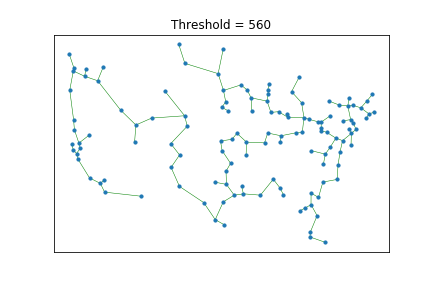

# Kruskal-Graph-Implementation
An implementation of kruskals algoirithm to find varying MST's based on a graph of the united states with 128 vertices and over 8000 edges. The implementation of kruskals and union are my own code the graph implementation was given.

# Example of all Vertices Mapped out

